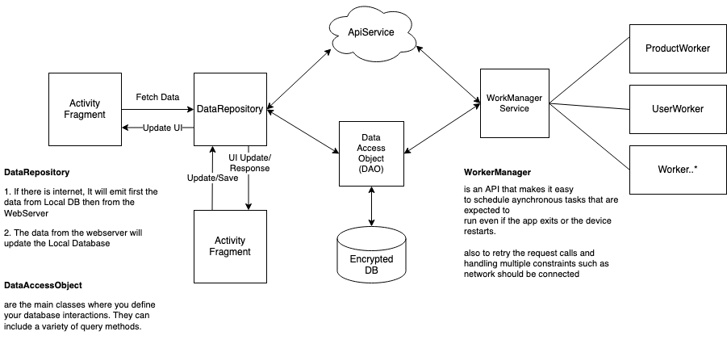

[Back](../README.md)

# Arventa Connect Android

## Technical Documentation

### **GETTING STARTED**

Arventa Connect Android is using Android Studio. This project uses Kotlin as the Programming Language, Android Studio Layout Editor for the Interface, and Gradle for connecting different Third-Party Libraries. The target and compile SDK Version is 29 with a minimum SDK version of 26.
For more information on the IDE and system requirements to enable you to work on the source code, it is available [here](https://developer.android.com/)

### **INSTALLATION AND DEVELOPMENT**

In order to start the development, first, you need to start Android Studio. Import the Arventa Connect Android project and then wait for the build to finish.
To make the app as small as possible, we enabled the shrinking of release build to remove unused code and resources. When enabling shrinking, you also benefit from obfuscation, which shortens the names of your app’s classes and members, and optimization, which applies more aggressive strategies to further reduce the size of your app.
https://developer.android.com/studio/build/shrink-code

### **PROGRAMMING LANGUAGE**

Arventa Connect Android uses Kotlin for development

### **MINIMUM VERSION**

Arventa Connect can run on Android Systems with minimum SDK version 23 or Android 6.0. It may encounter multiple issues on lower SDK versions.

### **APPLICATION ID**

au.com.arventa.rc

### **KEYSTORE**

Located in the repository: /keystore folder.

### **DEBUGGING**

We use **Android Virtual Device** in Android Studio in order to test the Native Apps in different screen sizes and SDK Versions.

### **WEB API**

https://www.arventa.com.au/authservice  
https://www.arventa.com.au/userservice    
The authservice is used for authentication purposes and the userservice is used to retrieve and push data to the server. We are using Postman to test the web API endpoints in order to determine which endpoints are properly working and have bugs.

### **APPLICATION ARCHITECTURE**

<kbd>
<!-- [Application Architecture](diagram.png 'Application Architecture') -->

</kbd>

### **THIRD-PARTY LIBRARIES**

Most of the third-party libraries are integrated using Gradle. They can be added by searching library names found in the Dependencies tab in the Project Structure window.

- #### **Important Libraries**

  - **Google Room** - provides an abstraction layer over SQLite to allow for more robust database access while harnessing the full power of SQLite. The library helps you create a cache of your app's data on a device that's running your app.
  - **Firebase/Crashlytics** - used to report crashes from Users that are not encountered during development and debugging.
  - **Work Manager** - is an API that makes it easy to schedule deferrable, asynchronous tasks that are expected to run even if the app exits or the device restarts.
  - **RxJava** - a library for composing asynchronous and event-based programs by using observable sequences. It extends the observer pattern to support sequences of data/events and adds operators that allow you to compose sequences together declaratively while abstracting away concerns about things like low-level threading, synchronization, thread-safety and concurrent data structures.
  - **SQLCipher** - extends the SQLite database library to add security enhancements that make it more suitable for encrypted local data storage
  - **Retrofit** - is type-safe REST client for Android and Java which aims to make it easier to consume RESTful web services.

### **IMPORTANT CLASSES**

- #### **Main Utilities**

  - **DatabaseAccess** - where the setup of the database and the integration of sqlcipher occurs. To access the local database, you need to instantiate this class.
  - **RetrofitBuilder** - a class which contains the network settings (i.e timeout span).
  - **WorkerService** - handles the worker that processes asynchronous tasks. This class will check the pending data to be synced to the server and vice versa.
  - **DataRepository** - this is a set of classes where the UI calls to access data. Handles the call to the local database and remote server. It will then emit the data to the UI once the data is available.
  - **AppPreferences** - handles the storing of simple data such as user name, if user login, etc.
  - **ApiService** - a class which contains the endpoints call. what kind of http request, the parameters to be passed, response type.
  - **ApiEndpoint** - a class which contains the constant endpoint strings

- #### **Activities/Fragments**

  - **LoginActivity** - handles the login page of the app
  - **MobileVerificationActivity** - handles the mobile verification page
  - **MainActivity** - serves as the container of every fragment. Additionally, this class manages the main drawer menu.
  - **SitesListActivity** - handles the listing of sites
  - **StorageListFragment** - display the list of storage
  - **StorageFormFragment** - handles the forms of storage/sub-storage
  - **ProductListFragment** - handles the listing of product
  - **ProductFormFragment** - handles the product form
  - **SearchFragment** - handles the page for searching
  - **PdfViewerFragment** - handles the PDF viewer
  - **ComplianceFragment** - handles the compliance of storage
